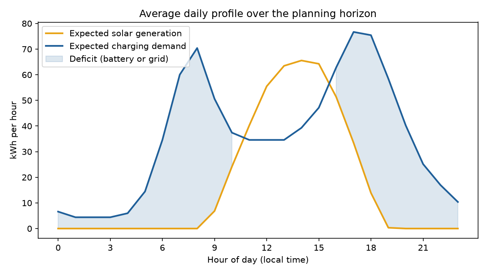
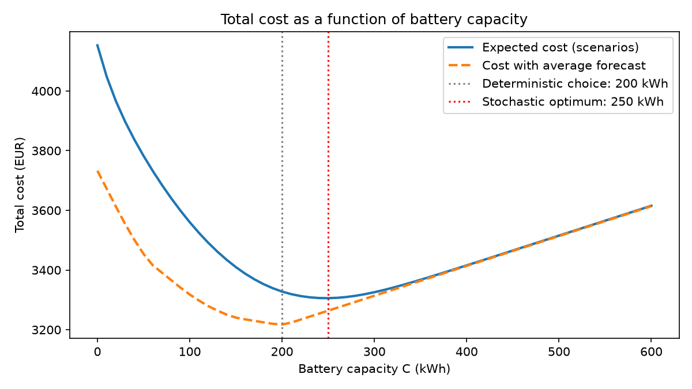
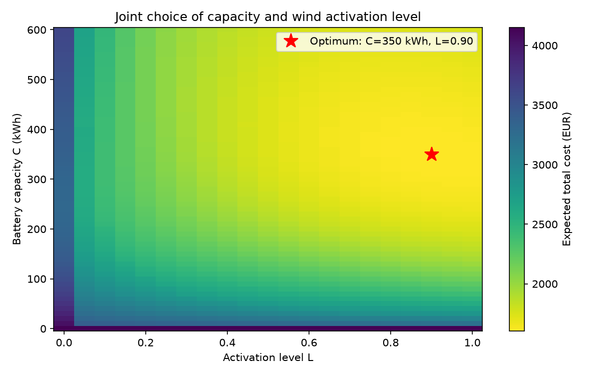
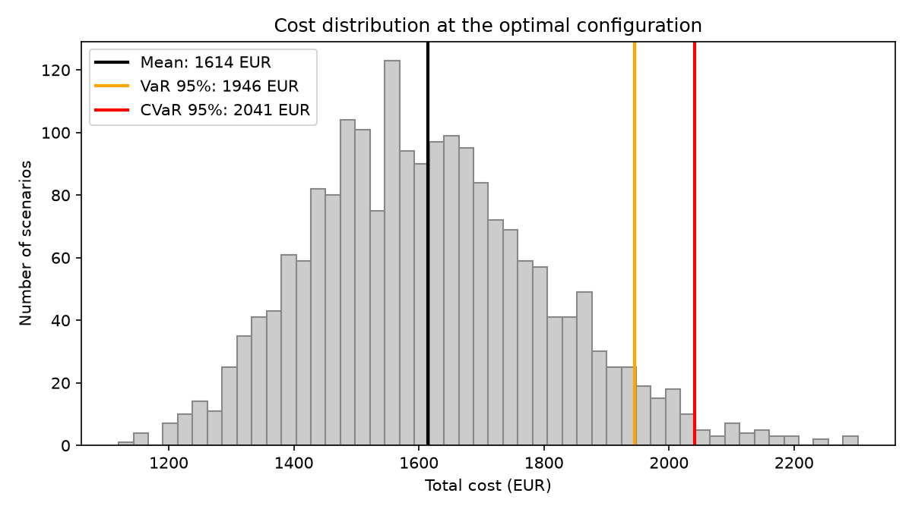

# Risk-aware battery sizing for a PV-and-storage EV charging hub

How large should be the battery of a solar-powered EV charging hub, when both sunshine and charging demand are uncertain? 
This project answers the question for a hub in Bielefeld, using real weather data, a probabilistic solar forecast and simulation-based optimisation.

## 1. The problem

A public fast-charging hub for electric cars in Bielefeld has a 250 kWp solar (PV) plant.
Solar power is free, but it is produced at midday, while most cars arrive in the morning and
in the evening. A battery can store midday surplus for later; without it, the surplus is lost
and the evening demand must be bought from the grid.



**Decision.** Before the planning period starts, the operator chooses the battery capacity
**C** (kWh). In an extended version, the operator also chooses an activation level **L** for a
flexible wind-power contract.

**Costs over the 14-day planning horizon:**

| Item | Cost |
|---|---|
| Battery capacity (investment, per 14 days) | 1.00 € per kWh of capacity |
| Electricity from the grid | 0.50 € per kWh |
| Electricity from the wind contract | 0.15 € per kWh, at most 20 kWh per hour |
| Surplus solar that cannot be stored | lost, no cost |

**Operating rule, every hour:**
1. Solar covers the charging demand directly.
2. Surplus solar charges the battery up to C.
3. Wind contract (extended version only): if the battery is below L × C at the start of the
   hour, up to 20 kWh of wind covers the deficit, and leftover wind refills the battery up to L × C.
4. Any remaining deficit is covered by the battery, then by the grid.

**Uncertainty.** 
Hourly solar generation (weather) and hourly charging demand (number of cars and energy per car) are both unknown when the battery is chosen.

**Goal.** 
Minimise expected total cost = battery cost + expected grid cost + expected wind cost. 

Two risk questions are added: 
how bad are the worst outcomes (VaR, CVaR), and how likely is it that more than 10 % of demand comes from the grid (green target of 90 %)?

## 2. Assumptions

**Location and horizon.** Bielefeld (52.03° N, 8.53° E); the next 14 days from the run date.

**Solar.**
- Hourly irradiance and cloud cover from the Open-Meteo API: three years of history (ERA5)
  to train the forecast, and the weather forecast for the planning horizon.
- PV output = 250 kWp × irradiance / 1000 × 0.80 (performance ratio). No tilt or
  temperature model.
- At night the sun is below the horizon, so PV output is exactly zero.

**Demand (simulated).** No open hub-level charging data exist for Germany, so demand is
generated by a stochastic model with documented parameters (`config/params.yaml`):
- cars arrive following a Poisson process with a commuter profile: morning and evening peaks
  on weekdays, a flatter midday pattern at weekends (about 41 cars per weekday, 32 per
  weekend day);
- each car charges a random amount of energy, LogNormal with mean 22 kWh and sd 10 kWh;
- fast chargers: each car is charged within its arrival hour;
- on average the hub delivers about 850 kWh per day.

**Battery and grid.**
- The battery starts empty and has no charging or discharging losses.
- The grid can always supply any missing energy.
- Wind energy counts as green; only grid energy counts against the 90 % target.

**Independence.** Weather does not influence how many cars arrive.

## 3. Method

1. **Probabilistic solar forecast.** An NGBoost model (Normal distribution) predicts, for each
   daytime hour, a mean and a standard deviation of PV output from the sun's elevation and
   the cloud cover.
2. **Scenarios.** 2,000 scenarios of 336 hours are drawn for solar and demand. Solar forecast
   errors within a day are correlated (a cloudy morning usually means a cloudy afternoon);
   the size of this common daily part is estimated from the training data (ρ = 0.42).
3. **Simulation-based optimisation.** For every candidate C (0–600 kWh) and L (0–1), the
   hourly battery operation is simulated in every scenario (Numba), and the expected cost is
   computed. The best combination is selected by grid search.
4. **Comparison with planning on averages.** The same optimisation is run once with average
   solar and average demand, as a planner without a probabilistic forecast would do.
5. **Out-of-sample evaluation and risk.** All decisions are evaluated on a second,
   independent set of 2,000 scenarios: expected cost, 95 % VaR and CVaR of cost, green
   quota, and the probability of missing the 90 % target. A final variant adds a penalty of
   100 € per percentage point below the target.

## 4. Results

Planning horizon: 9–22 October 2026. Because the horizon is always the next 14 days, the
numbers change with every run; `results/summary.json` holds the latest values.

| Strategy | Battery C | Activation level L | Expected cost |
|---|---|---|---|
| Plan with average forecast | 200 kWh | – | 3,336 € (planned: 3,218 €) |
| Plan with scenarios | 250 kWh | – | 3,314 € |
| + flexible wind contract | 350 kWh | 0.90 | 1,614 € |
| + penalty for missing the 90 % green target | 360 kWh | 0.95 | 1,615 € |

**Finding 1: planning on averages is too optimistic.** With average solar and demand, the
planner chooses 200 kWh and expects to pay 3,218 €. Under real uncertainty the same battery
costs 3,336 €, i.e. 118 € (3.7 %) more than planned. Using the scenarios leads to a larger
battery (250 kWh) that saves 21 € on average.



**Finding 2: flexible supply and storage are complements.** The wind contract halves the
expected cost, and the optimal battery becomes *larger* (350 kWh), not smaller: the battery
now also stores cheap wind energy (0.15 €/kWh) that replaces expensive grid energy
(0.50 €/kWh) later.



**Finding 3: risk and the green target.** At the optimum with wind contract, 95 % of the
scenarios cost less than 1,946 € (VaR), and the worst 5 % cost 2,041 € on average (CVaR).
On average 93 % of demand is covered without the grid, but in 11 % of the scenarios the
90 % target is missed. Adding the shortfall penalty slightly increases C and L, lowers this
probability to 8 %, and costs only 1.5 € more in expectation.



The uncertainty behind these results is shown in the
[solar scenarios](results/figures/02_solar_scenarios.png).

## 5. Limitations

- Demand is simulated, not measured; results depend on the assumed arrival profile.
- The solar model is trained on reanalysis cloud cover but applied to forecast cloud cover,
  which may understate forecast uncertainty.
- The PV and battery models are deliberately simple (no tilt, temperature or efficiency losses).
- Weather and demand are assumed to be independent.

## 6. How to run

You can run the whole pipeline yourself. Clone the repository and run the following:


```bash
python -m venv .venv
source .venv/Scripts/activate      # Windows Git Bash; on Linux/macOS: source .venv/bin/activate
pip install -e ".[dev]"
python scripts/run_pipeline.py --refresh   # download fresh data and run everything
python -m pytest -q                        # tests
```

All parameters (location, PV size, prices, demand profile, number of scenarios) are in
`config/params.yaml`. Set `horizon.mode: historical` to analyse a past period instead of the
forecast.

## 7. Project structure

```
config/params.yaml          all model inputs
src/hubsizing/
    weather.py              Open-Meteo download, solar position, PV output
    demand.py               stochastic charging demand
    forecasting.py          NGBoost forecast and correlated solar scenarios
    simulation.py           hourly battery operation and costs
    optimize.py             grid search over C and (C, L)
    risk.py                 VaR, CVaR, green quota, shortfall penalty
    plots.py                figures
scripts/run_pipeline.py     end-to-end analysis
tests/                      sanity checks
results/                    summary.json and figures
```

## Background

The idea for this project comes from a homework assignment in the course *Combining OR and
Data Science* (Prof. Dr. Michael Römer, Bielefeld University, summer term 2026). This version
does not use the course data. Weather data are downloaded automatically from the Open-Meteo
API, and charging demand is generated by a documented demand simulator. The original analysis
is also extended with correlated scenarios, out-of-sample evaluation and upper-tail risk
measures (VaR and CVaR).

Weather data: [Open-Meteo](https://open-meteo.com) (CC BY 4.0).